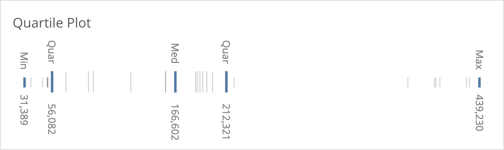

# datorama-d3-quartile-plot
Custom widget for Datorama. Creates a minimalistic quartile/box plot.

Analyse the distribution of data points and retain context when filtering down through large data sets.

Tips:
* If using this to provide context when drilling down through large lists, make sure any interactive filters *do not* apply to this.

Restrictions:
* One dimension, and one measurement
* At least ten rows in the query response



## Common Style Changes
To change the accent colour, add this to the CSS section of the Custom Widget Editor.
```
.boxLine {
  stroke: rgb(78, 121, 167);
}
```

## Set up and Dependencies
Add `quartilePlot.initialize();` to the JS section of the Custom Widget Editor, and add the below links to the dependencies area (second button at the top left of the Custom Widget Editor).

Script dependencies (must be loaded in this order):
1. `https://d3js.org/d3.v5.min.js`
2. `https://dato-custom-widgets-js-css.s3.eu-west-2.amazonaws.com/quartile-plot/Quartile+Plot.js`

Style dependency:
1. `https://dato-custom-widgets-js-css.s3.eu-west-2.amazonaws.com/quartile-plot/Quartile+Plot.css`
